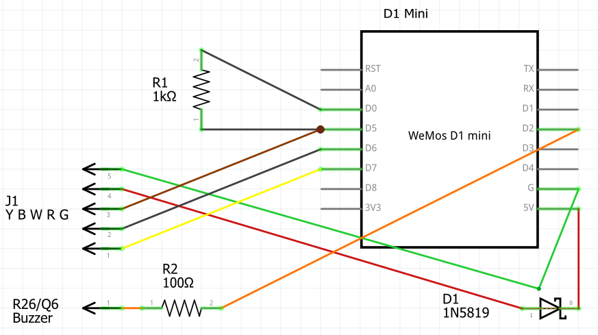
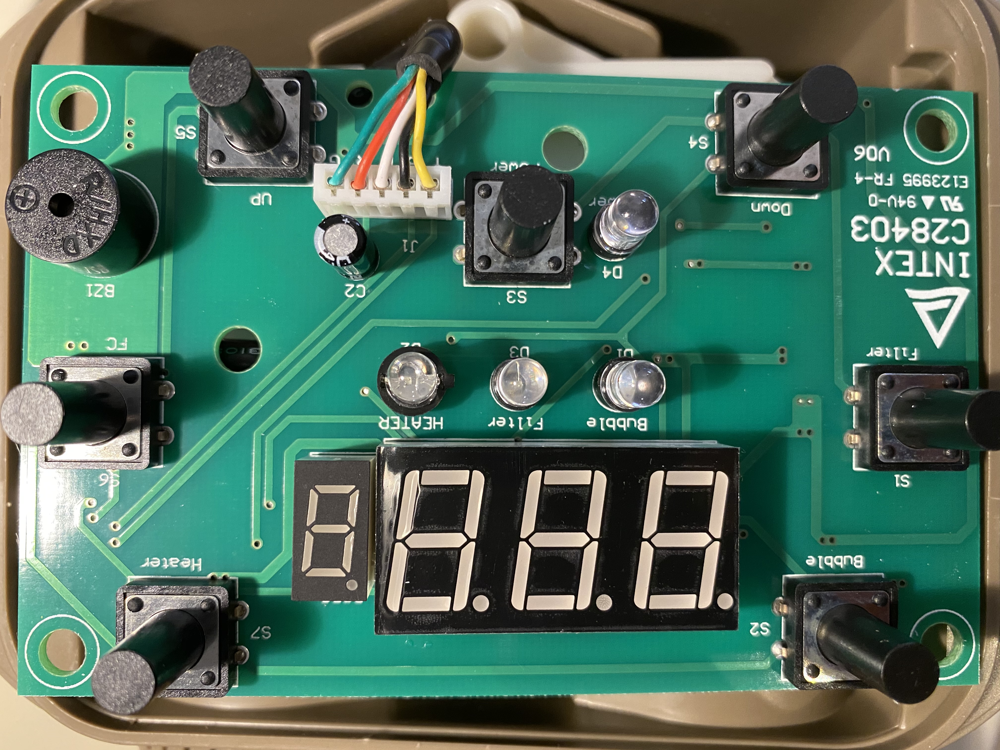
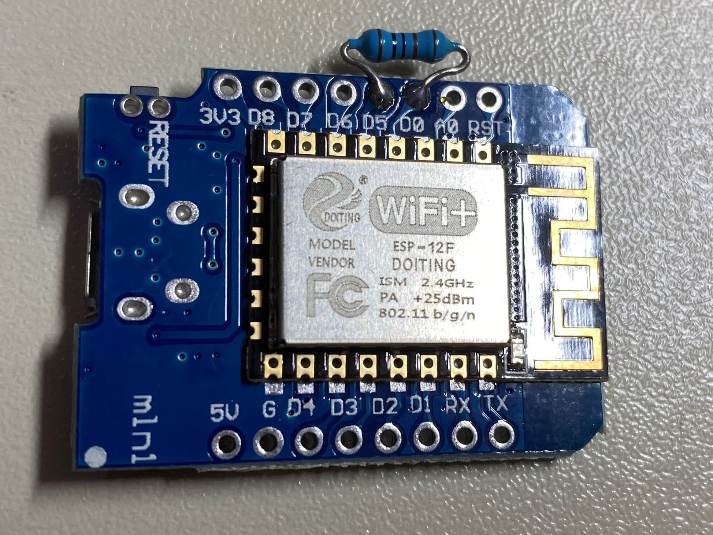
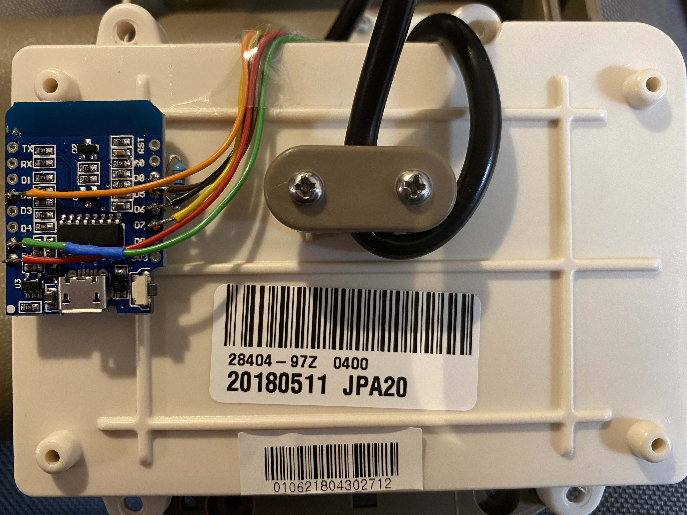
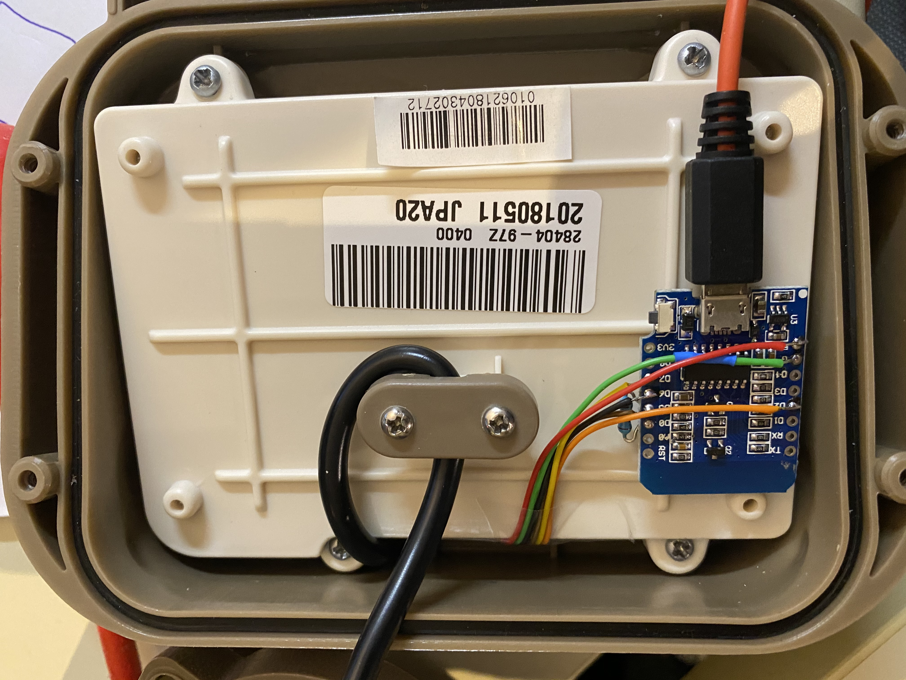
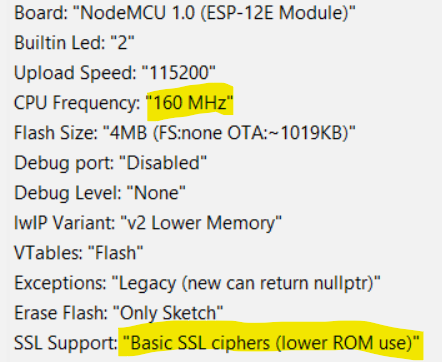
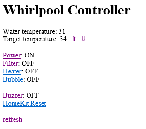
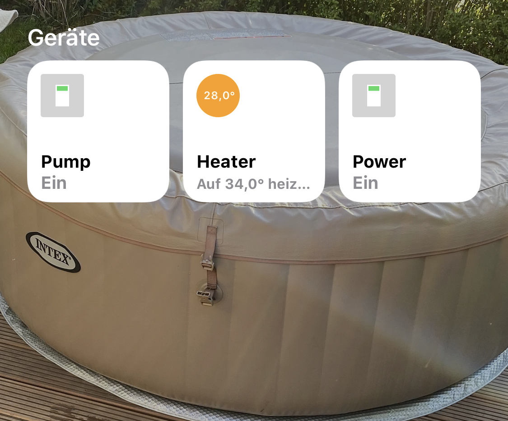

# MaiPureSpaController
## IoT Controller for Intex PureSPAtm
This solution will allow you to control your Intex PureSpatm SSP-H_20-1C from your iPhone/iPad/Watch using HomeKit. I tried to keep the hardware to a minimum, no PCB needed, but you need to open the display and do some soldering, which will void your warranty. 

It is still kind of unstable, but it is work in progress, suggestions to improve stability are welcome.

## History
  This is my first Arduino project, and I like to apologize for my coding style, C++ is not my native programming language.
  I played with Arduino, and and ESP8266 NodeMCU1.0 but had no interesting useful project, until I bought an whirlpool in summer 2019. I wanted to remote control my Intex PureSpa(tm) SSP-H_20-1C! I opened the control panel, saw the 74HC595 and had an idea how this may work. I decoded the signal bits by looking at the PCB. I bought a cheep 10€ logic analyzer that helped a lot. I used my Arduino mini to simulate the signal, so I don't have to sit around the pool while testing my solutions. First I tried to use existing ESP 8266 SPI interface in slave mode to receive the signals, with no luck. The SPI slave driver has to much protocol logic built in that is not needed. So the project rested over the winter.
  
  Thanks to [tinwhisker/IntexSpaRemote](https://github.com/tinwhisker/IntexSpaRemote) I restarted by project this year 2020. I followed the interrupt driven approach and it worked! I also solved the problem to simulate the button push.
  
  Because I had no existing home automation infrastructure yet, I thought it would be nice to integrate with Apple HomeKit and found [Mixiaoxiao/Arduino-HomeKit-ESP8266](https://github.com/Mixiaoxiao/Arduino-HomeKit-ESP8266) project with several nice examples. After some nights, I had a working accessory definition for the pool.

  Finally I did throw the SPI decoder, the HomeKit integration, OTA and a web server page together and it somehow worked, just in-time for the pool season, that started May 1st. 

## Hardware
### Schematic
 
D5, D6, D7 are connected in parallel to the serial signals flowing to the display from the main controller. This will be decoded to read the LED status, the displayed temperatures and simulate the button press at the right time.

D0 is used to simulate the button press by dragging the data line D5 low. R1 has the same value as the corresponding R25 on the display PCB.

R2 with the connection to buzzer circuitry is used to shut off the buzzer (I hate that beep) and control it thru D2 for signaling purpose during startup. The resistor value resulted from tries, not calculation. If you think this might harm the ESP, and another value is working for you better, let me know.

The diode allows 5V power to flow only to the ESP. Otherwise your USB port will power complete pool main unit, if you connect a cable for serial debugging or flashing.

As you can see, I don't use any logic level converters. Not using them makes the hardware setup much simpler and there other solution out there that work well without converters. 

### Components
You need these components:
- ESP8266 with 4Mbit in mini format, eg. D1 Mini
- Resistors 1kOhm, 100Ohm
- Schottky diode 1N5819
- double sided tape to fix the ESP on the back of the panel
- some wires and heat shrink tubing

### Wiring
Please see the wiring on the following pictures:

 

 

 

 

 

 
## Firmware
### Signal analysis
The signal sent from the main unit to the display looks like this:

While select signal (1) is low, 16 bits are sent with each clock pulse (2). The data signal (3) is read on the rising edge of clock pulse. The most significant bit is sent first. This kind of transmission is very similar to an SPI mode 3 interface [Serial Peripheral Interface](https://en.wikipedia.org/wiki/Serial_Peripheral_Interface).

This table shows the meaning of the bits:

Each 16bit transmission either 
- displays a number on one of the 4 digits, 
- lights a combination of the LEDs,
- queries one of the buttons,
- or generates a beep.

All display elements are addressed in each cycle. The duration of one cycle is 20ms, meaning it repeats with a frequency of 50Hz. This is fast enough, that you don't see the display or LED flicker.
With the above information we can decode the data stream and read the temperature, see if the power, pump or heater is on.

### The button press problem
To really remote control the pool, we need to simulate pressing the buttons. This will enable us to switch the pool on, select a heating temperature and start heating the pool.
Several project out here are struggling with the problem to solve this with software. This project [YorffoeG/diyscip](https://github.com/YorffoeG/diyscip) uses extra hardware to solve that problem.

To simulate a button press, we need to pull the data line low for the next 16bit transmission after we received the code for one of the button queries. I use an extra digital output pin (D0) connected to the data input pin (D5) with a 1kOhm resistor. This is exactly what the pool display hardware does.

Example: If we want to simulate a power button press, we need to wait for the data 0xFBFF (ignoring the buzzer bit) and then set D0 to low. We need to repeat this 10 times to be recognized as a valid button press.

**Timing is very critical!** When the select signal goes high, ending a 16 bit cycle, we need to pull down the data signal as fast as possible. My current solution needs 5µs, and this works:

I added some code once for debugging purpose that adds another 0.8µs to that delay and button press was not recognized anymore. To be that fast you need to select 160MHz CPU frequency, but this is needed for the HomeKit library anyway.

### Building the firmware
I used Arduino IDE 1.8.12 with the following board settings:

You need to install the following libraries:
- HomeKit-ESP8266 by Mixiaoxiao Version 1.2.0
- ArduinoQueue by Einar Arnason Version 1.2.3

The ESP8266WiFi, ESP8266WebServer and ArduinoOTA libraries should be there by default.

You need to edit the Private.h file and add you wifi SSID and password and choose an password for OTA updates.

Then try to build it and download it to you module.

### Web UI
The firmware offers an web interface, that you can check in first place, before trying to connect to HomeKit. It is not really needed, except for resetting the HomeKit connection. It is a relict from the time before I added the HomeKit integration.

### HomeKit Setup
Please see the screen shots in docs folder (homekit_setup_*.png) for the pairing procedure

## Buzzer Beeps
One of the wires I connected to the display controller board gave me control over the buzzer. First and main idea was to shut off the annoying beeps. But I also use it for signaling. You will hear 3 beeps during startup:
1. the setup routine starts
2. Wifi has successfully connected
3. HomeKit connection established

## Known problems
- It is not very stable, meaning it reboots several times a day. I have not figured out why. Please let me know if you found something that makes more stable for you.
- Sometime it is not connecting to the wifi after such a reboot and you need to turn the power off/on.
- After a reboot, it has lost the target temperature. I planned to persist the value, to restore it after a reboot.
- Sometimes the call of the ISR is delayed and clock pulses are missed with gives wrong LED status. You can notice this when the HomeKit controls flicker.
- It might need several retries to pair with HomeKit.
- You need to switch the power on before heater or pump control will have any effect on the unit. There is room for improvement in the future.

## Alternative solution, future developments
- I have looked into ESP-32 and the SPI slave mode and got it to work. But even with the built-in SPI interface of the ESP-32, the time needed to trigger the interrupts was to long and it misses some data.
- I am planning contribute to [YorffoeG/diyscip](https://github.com/YorffoeG/diyscip) project. The code is much cleaner and well structured, with a nice configuration interface.

## Tools
### [AZDelivery Logic Analyzer](https://www.amazon.de/dp/B01MUFRHQ2/ref=cm_sw_em_r_mt_dp_U_rV88EbT2E5JSH)
This a very cheap tool that helps a lot analyzing the SPI signals. I also used it to debug inside the time critical interrupt routines, by setting extra digital out pins high/low.

